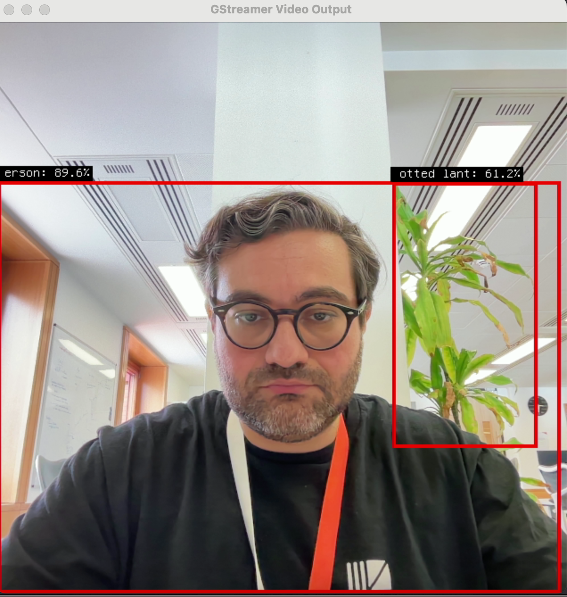

# `pup`


**Table of Contents**

- [About](#about)
  - [Why Rust?](#why-rust)
- [Architecture](#architecture)
- [Usage](#usage)
- [Model Requirements](#model-requirements)
- [Deploying to NXP i.MX93](#deploying-to-nxp-imx93)
- [Memory Footprint](#memory-footprint)
- [Cross-compiling](#cross-compiling)
- [Refs](#refs)
- [Licence](#licence)

## About

`pup` is a real-time object detection application built in Rust. It uses YOLOv8
ONNX models for inference on video frames via a GStreamer pipeline, with results
rendered as bounding box overlays directly on the video output.

The core libraries are GStreamer for video pipeline management and ONNX Runtime
(via the `ort` crate) with CoreML acceleration on macOS for high-performance
inference.

### Why Rust?

1. **Cross-compiling for hardware agnostic deployment.** By leveraging the Rust
   toolchain ecosystem, a single codebase can produce executable binaries across
   many different hardware targets.

2. **Full control over memory usage, binary size and optimisation.** Rust as a
   statically typed, memory safe language gives the programmer confidence in how
   memory is being used -- essential for resource-constrained deployment
   settings.

## Architecture

`pup` combines two core libraries into a single real-time inference pipeline:

**GStreamer** handles the entire video lifecycle -- capturing frames from a
webcam or decoding them from a file, converting colour spaces, scaling, and
rendering the final output to a display window. The pipeline uses a `tee`
element to split the video into two parallel branches: one for display and one
for inference. A GStreamer
[pad probe](https://gstreamer.freedesktop.org/documentation/application-development/advanced/pipeline-manipulation.html)
on the display branch draws bounding boxes directly into the video buffer
before it reaches the video sink, so overlays appear with minimal latency.

**ONNX Runtime** (via the [`ort`](https://docs.rs/ort) crate) runs the YOLOv8
model. On macOS, the `ort` session is configured with the CoreML execution
provider, which offloads inference to the Apple Neural Engine or GPU when
available, falling back to CPU transparently. The inference path extracts raw
RGB frame data from an `appsink`, normalises pixel values to `[0.0, 1.0]`,
reshapes from HWC to CHW format, and feeds the resulting `[1, 3, 640, 640]`
tensor into the ORT session. The YOLOv8 output (`[1, 84, 8400]`) is then
post-processed with confidence filtering and non-maximum suppression to produce
the final detection list.

```
                         ┌─────────────┐
                         │  Video Src  │
                         │ (webcam/file)│
                         └──────┬──────┘
                                │
                         ┌──────┴──────┐
                         │  decodebin  │
                         │ videoconvert│
                         │  videoscale │
                         │ capsfilter  │
                         │ (RGB 640x640)│
                         └──────┬──────┘
                                │
                           ┌────┴────┐
                           │   tee   │
                           └────┬────┘
                          ╱            ╲
                   ┌─────┴─────┐  ┌────┴─────┐
                   │  queue 1  │  │  queue 2  │
                   └─────┬─────┘  └────┬─────┘
                         │              │
                   ┌─────┴─────┐  ┌────┴──────┐
                   │  appsink  │  │ pad probe │
                   │ (extract  │  │  (draw    │
                   │  frames)  │  │ overlays) │
                   └─────┬─────┘  └────┬──────┘
                         │              │
                   ┌─────┴─────┐  ┌────┴──────┐
                   │ ORT infer │  │ videosink │
                   │ (YOLOv8)  │  │ (display) │
                   └─────┬─────┘  └───────────┘
                         │
                   ┌─────┴─────┐
                   │ detections│──── shared via Arc<Mutex<>>
                   └───────────┘
```

The inference branch writes its detection results into a shared
`Arc<Mutex<Vec<Detection>>>`. The display branch's pad probe reads those
detections on each frame and renders bounding boxes, class labels, and
confidence scores directly into the pixel buffer before display.

## Usage

```bash
# Process webcam (default)
cargo run --release

# Process video file
cargo run --release -- --input assets/sample.mp4

# Custom model and confidence threshold
cargo run --release -- --model models/yolov8n.onnx --confidence 0.7

# Disable overlays (detection logging only)
cargo run --release -- --no-overlays

# Hide labels or confidence scores on bounding boxes
cargo run --release -- --no-labels --no-confidence

# Enable verbose logging
cargo run --release -- --verbose
```

> **Note:** This assumes Rust is installed on the host system. If not, run:
> `curl --proto '=https' --tlsv1.2 -sSf https://sh.rustup.rs | sh`

> **Model Required:** You need a YOLOv8 ONNX model file. Place `yolov8n.onnx`
> in the `models/` directory.

Running on a webcam with real-time overlays:



Processing a video file with bounding box annotations:


Detection information is printed to stdout:

```bash
...
Processing frame 160
generated predictions Tensor[dims 84, 4620; f32]
person: Bbox { xmin: 25.402996, ymin: 281.722, xmax: 37.93538, ymax: 305.6891, confidence: 0.5820799, data: [] }
car: Bbox { xmin: 33.109806, ymin: 284.62817, xmax: 109.44653, ymax: 320.54688, confidence: 0.8652527, data: [] }
truck: Bbox { xmin: 150.58142, ymin: 265.03888, xmax: 198.64215, ymax: 297.8924, confidence: 0.63634956, data: [] }
Processing frame 165
generated predictions Tensor[dims 84, 4620; f32]
person: Bbox { xmin: 29.655272, ymin: 281.85794, xmax: 39.016144, ymax: 299.11453, confidence: 0.56209296, data: [] }
car: Bbox { xmin: 20.964737, ymin: 286.7253, xmax: 101.58455, ymax: 324.42282, confidence: 0.84946674, data: [] }
traffic light: Bbox { xmin: 35.862103, ymin: 219.83334, xmax: 45.31969, ymax: 249.05392, confidence: 0.44971594, data: [] }
...
```

## Model Requirements

`pup` requires a YOLOv8 ONNX model for object detection. The model expects:

- **Input shape:** `[1, 3, 640, 640]` (batch, RGB channels, height, width)
- **Output format:** `[1, 84, #boxes]` where 84 = 4 bounding box coordinates + 80 COCO class scores
- **Location:** Place model files in the `models/` directory

## Deploying to NXP i.MX93

The i.MX93 is a target deployment platform for `pup`. This section outlines the
hardware capabilities, required code changes, and cross-compilation workflow.

### i.MX93 Hardware Overview

| Component | Detail |
|-----------|--------|
| CPU | Dual Cortex-A55 (aarch64) |
| NPU | Arm Ethos-U65 (0.5 TOPS) |
| 2D Engine | PXP (Pixel Pipeline) -- no 3D GPU |
| Camera | MIPI CSI-2 via V4L2 |
| Display | LVDS / MIPI DSI via Wayland |
| BSP | NXP Yocto (meta-imx, LF6.12.x) |
| ML Stack | NXP eIQ -- TFLite, ONNX Runtime, PyTorch |

### Code Changes Required

#### 1. GStreamer Pipeline -- PXP Hardware Acceleration

The i.MX93 has no GPU. Instead it provides a PXP (Pixel Pipeline) engine for
hardware-accelerated colour space conversion, scaling, and rotation. The
GStreamer pipeline in `src/live.rs` must swap software elements for
PXP-accelerated ones:

| macOS (current) | i.MX93 (target) | Purpose |
|-----------------|-----------------|---------|
| `autovideosrc` | `v4l2src device=/dev/video0` | Camera capture via MIPI CSI |
| `videoconvert` | `imxvideoconvert_pxp` | Colour space conversion (HW) |
| `videoscale` | `imxvideoconvert_pxp` | Scaling (HW, same element) |
| `osxvideosink` | `waylandsink` | Display via Wayland compositor |
| `decodebin` | `vpudec` (if available) | Hardware video decoding |

Example target pipeline for camera input:

```
v4l2src device=/dev/video0
  ! video/x-raw,format=YUY2,width=640,height=480
  ! imxvideoconvert_pxp
  ! video/x-raw,format=RGB,width=640,height=640
  ! tee name=t
  t. ! queue ! appsink                    (inference branch)
  t. ! queue ! imxvideoconvert_pxp        (overlay + display branch)
     ! waylandsink
```

These element swaps should be driven by a runtime platform check or a compile-time
feature flag (e.g., `#[cfg(feature = "imx93")]`), so the same codebase targets
both macOS development and i.MX93 deployment.

#### 2. ORT Execution Provider -- VsiNPU / Ethos-U65

On macOS, `pup` uses the CoreML execution provider. On the i.MX93, the
available ONNX Runtime execution providers are:

- **CPU** -- always available, baseline fallback
- **VsiNPU** -- VeriSilicon NPU acceleration via the NXP eIQ stack
- **Neutron** -- experimental NPU EP (primarily i.MX95, not yet broadly
  available on i.MX93)

The `ort` crate configuration in `Cargo.toml` would need a new target section:

```toml
[target.'cfg(target_os = "linux")'.dependencies]
ort = { version = "2.0.0-rc.10", features = ["download-binaries"] }
```

However, for the i.MX93 the `download-binaries` feature will not include
VsiNPU support. Instead, `pup` must link against the ORT libraries provided by
the NXP BSP (typically installed at `/usr/lib/` on the Yocto image). This
requires:

1. Disabling `download-binaries` and setting `ORT_LIB_LOCATION` to the BSP's
   ORT installation
2. Selecting the VsiNPU execution provider at session creation time in
   `src/inference/ort_backend.rs`

#### 3. Model Quantisation

The Ethos-U65 NPU requires INT8 quantised models. The FP32 `yolov8n.onnx`
model used on macOS will run on CPU but will not be accelerated by the NPU.
To get NPU acceleration:

1. Quantise the model to INT8 using the ONNX Runtime quantisation tools or
   NXP's `onnx2neutron` converter
2. Validate that post-quantisation accuracy is acceptable
3. Place the quantised model alongside the FP32 model in `models/`

```bash
# Example quantisation using onnxruntime
python -m onnxruntime.quantization.preprocess --input models/yolov8n.onnx \
    --output models/yolov8n_preprocessed.onnx

python -m onnxruntime.quantization.quantize \
    --input models/yolov8n_preprocessed.onnx \
    --output models/yolov8n_int8.onnx \
    --quant_format QDQ
```

#### 4. OpenCV Dependency

OpenCV is used for preprocessing (letterboxing). On the i.MX93, OpenCV must
either be cross-compiled as part of the Yocto image or replaced with a lighter
alternative (e.g., `image` + `fast_image_resize` crates, as the reference repo
at `lib/gstreamed_rust_inference/` demonstrates). Removing the OpenCV
dependency would significantly simplify cross-compilation.

### Cross-Compilation Workflow

#### Prerequisites

- NXP i.MX93 EVK (or compatible board, e.g., MaaXBoard OSM93)
- Yocto BSP image built with eIQ, GStreamer, and ORT support
- Yocto SDK extracted on the build host

#### Step 1: Build the Yocto SDK

On the Yocto build machine:

```bash
# Clone meta-imx and set up the build
repo init -u https://github.com/nxp-imx/imx-manifest -b imx-linux-scarthgap \
    -m imx-6.12.3-1.0.0.xml
repo sync

# Set up the build environment for i.MX93
DISTRO=fsl-imx-wayland MACHINE=imx93-11x11-lpddr4x-evk \
    source imx-setup-release.sh -b build-imx93

# Build the image with ML support
bitbake imx-image-full

# Export the SDK
bitbake -c populate_sdk imx-image-full
```

#### Step 2: Install the SDK and Rust target

On the development host (macOS or Linux):

```bash
# Install the Yocto SDK (Linux host required for the SDK itself)
./fsl-imx-wayland-glibc-x86_64-imx-image-full-aarch64-imx93-11x11-lpddr4x-evk-toolchain-6.12.3-1.0.0.sh

# Source the SDK environment
source /opt/fsl-imx-wayland/6.12.3-1.0.0/environment-setup-aarch64-poky-linux

# Add the Rust cross-compilation target
rustup target add aarch64-unknown-linux-gnu
```

#### Step 3: Configure Cargo for cross-compilation

Create or update `.cargo/config.toml`:

```toml
[target.aarch64-unknown-linux-gnu]
linker = "aarch64-poky-linux-gcc"

[env]
# Point to the Yocto sysroot for native libraries (GStreamer, ORT, OpenCV)
PKG_CONFIG_SYSROOT_DIR = "/opt/fsl-imx-wayland/6.12.3-1.0.0/sysroots/aarch64-poky-linux"
PKG_CONFIG_PATH = "/opt/fsl-imx-wayland/6.12.3-1.0.0/sysroots/aarch64-poky-linux/usr/lib/pkgconfig"

# ORT: use BSP-provided libraries instead of downloading
ORT_LIB_LOCATION = "/opt/fsl-imx-wayland/6.12.3-1.0.0/sysroots/aarch64-poky-linux/usr/lib"
```

#### Step 4: Build

```bash
cargo build --release --target aarch64-unknown-linux-gnu
```

#### Step 5: Deploy

```bash
# Copy the binary and model to the board
scp target/aarch64-unknown-linux-gnu/release/pup root@<board-ip>:/usr/local/bin/
scp models/yolov8n.onnx root@<board-ip>:/home/root/models/

# Run on the board
ssh root@<board-ip>
pup --input /dev/video0 --model /home/root/models/yolov8n.onnx
```

### Summary of Changes

| Area | macOS (development) | i.MX93 (deployment) |
|------|--------------------|--------------------|
| Video source | `autovideosrc` | `v4l2src` (MIPI CSI) |
| Colour conversion | `videoconvert` (software) | `imxvideoconvert_pxp` (PXP HW) |
| Display | `osxvideosink` | `waylandsink` (Wayland) |
| ORT provider | CoreML | VsiNPU / CPU |
| Model format | FP32 ONNX | INT8 quantised ONNX |
| OpenCV | Homebrew | Yocto sysroot (or replaced) |
| NSApp workaround | Required | Not needed |

## Memory Footprint

With current optimisation settings, using `--release` sets `opt-level` to 3 for
better speed. The resulting binary is approximately 5 MB:

```bash
$ du -sh target/release/pup
5.7M    pup
```

With additional size optimisations:

```diff
+ [profile.release]
+ codegen-units = 1   # Reduce number of codegen units to increase optimisations.
+ lto = true          # Enable Link Time Optimisation
+ opt-level = "z"     # Optimise for size.
+ panic = "abort"     # Abort on panic
+ strip = true        # Automatically strip symbols from the binary.
```

the binary can be reduced to approximately 3 MB:

```bash
$ du -sh target/release/pup
2.8M    pup
```

See the [Cargo Book](https://doc.rust-lang.org/cargo/reference/profiles.html) or
[min-sized-rust](https://github.com/johnthagen/min-sized-rust) for further
details on binary size optimisation.

### `cargo-bloat` and `cargo-size`

Two useful cargo crates for inspecting where memory is being used:
[`cargo bloat`](https://github.com/RazrFalcon/cargo-bloat) and
[`cargo size`](https://github.com/rust-embedded/cargo-binutils) (syntactic sugar
for the `rust-size` utility from `cargo-binutils`).

```bash
$ rust-size -A target/release/pup
target/release/pup  :
section                 size         addr
__text               1576592   4294984896
__stubs                 1620   4296561488
__stub_helper           1620   4296563108
__const              1017480   4296564736
__gcc_except_tab        6360   4297582216
__cstring                 52   4297588576
__unwind_info          21592   4297588628
__eh_frame             42712   4297610224
__got                     80   4297654272
__const                73816   4297654352
__la_symbol_ptr         1064   4297736192
__data                  1712   4297737256
__thread_vars            672   4297738968
__thread_data             64   4297739640
__thread_bss             392   4297739704
__bss                   1128   4297740096
__common                   4   4297741224
Total                2746960
```

### Runtime

To investigate the runtime memory footprint on macOS using the `leaks` utility:

```bash
$ leaks --atExit -- ./target/release/pup --input assets/sample.mp4

Physical footprint:         95.9M
Physical footprint (peak):  687.3M

Process 24864: 19369 nodes malloced for 34590 KB
Process 24864: 0 leaks for 0 total leaked bytes.
```

Average memory usage of approximately 100 MB with peak usage of approximately 690 MB and
zero memory leaks.

## Cross-compiling

One of the most attractive aspects of Rust is its cross-compilation support.
Currently `pup` has been developed on arm64 macOS:

```bash
$ file target/release/pup
target/release/pup: Mach-O 64-bit executable arm64
```

Cross-compiling from macOS to Linux can be fiddly. Useful resources:

- [rust-cross](https://github.com/japaric/rust-cross) -- general guidance
- [cross-rs](https://github.com/cross-rs/cross) -- Docker-based cross-compilation
- [rust-musl-cross](https://github.com/rust-cross/rust-musl-cross) -- musl-based static linking
- [opencv-rust cross-compilation](https://github.com/twistedfall/opencv-rust/blob/master/INSTALL.md#crosscompilation)

## Refs

- [`ort` crate documentation](https://docs.rs/ort) -- Rust bindings for ONNX Runtime
- [ONNX Runtime execution providers](https://onnxruntime.ai/docs/execution-providers/) -- CoreML, CUDA, TensorRT, etc.
- [GStreamer Rust bindings (`gstreamer-rs`)](https://gitlab.freedesktop.org/gstreamer/gstreamer-rs)
- [Implementing YOLOv8 Object Detection with OpenCV in Rust Using ONNX Models](https://linzichun.com/posts/rust-opencv-onnx-yolov8-detect/)
- [i.MX Machine Learning User's Guide (eIQ)](https://www.nxp.com/docs/en/user-guide/UG10166.pdf) -- ORT, TFLite, NPU setup
- [i.MX Yocto Project User's Guide](https://www.nxp.com/docs/en/user-guide/UG10164.pdf) -- BSP build and SDK
- [i.MX93 PXP Use Case Guide](https://api.aiotcloud.nxp.com.cn/static/2024-9-27/HKjhCdH7ESpxpUseCase.pdf) -- PXP GStreamer plugins
- [Accelerating AI on MaaXBoard OSM93: Camera Pipeline](https://www.hackster.io/monica/accelerating-ai-on-maaxboard-osm93-part-3-camera-pipeline-822c68)
- [GStreamer Plugins for meta-imx](https://deepwiki.com/nxp-imx/meta-imx/5.1-gstreamer-plugins)
- [Rust on Yocto (Memfault)](https://interrupt.memfault.com/blog/rust-in-yocto) -- integrating Rust into Yocto builds
- [meta-rust-bin](https://github.com/rust-embedded/meta-rust-bin) -- pre-built Rust toolchains for Yocto
- [Rust platform support](https://doc.rust-lang.org/rustc/platform-support.html)
- [Cargo Book](https://doc.rust-lang.org/cargo/index.html)
- [Optimise for size](https://docs.rust-embedded.org/book/unsorted/speed-vs-size.html)

## Licence

`pup` is distributed under the terms of the [MIT](https://spdx.org/licenses/MIT.html) licence.
